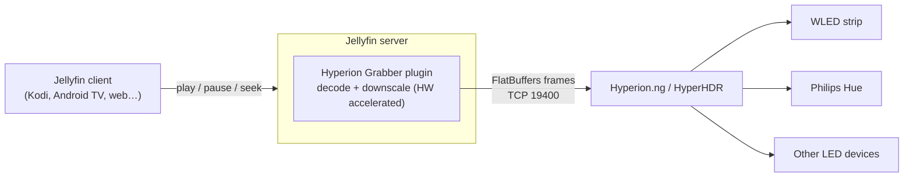

# Hyperion Grabber for Jellyfin

**Ambient lighting for everything you watch in Jellyfin.**
The plugin streams the playing video to [Hyperion.ng](https://github.com/hyperion-project/hyperion.ng) or
[HyperHDR](https://github.com/awawa-dev/HyperHDR), which drive your WLED strips, Philips Hue lights and every other
LED device they support.

> [!NOTE]
> **Early preview (v0.x).** The current version streams library videos to Hyperion/HyperHDR while they play on the
> devices you select, and plays an LED layout test pattern. A status panel, per-device latency calibration and HDR tone
> mapping are next, see the [roadmap](https://25lion52.github.io/JellyfinHyperionGrabber/roadmap/).

## Why

Classic ambilight setups capture the HDMI signal or grab the screen on the TV. That needs extra hardware, breaks on
HDR and DRM, and does not work at all on many clients: on a Raspberry Pi running LibreELEC/Kodi, for example,
hardware-decoded video is invisible to screen grabbers.

This plugin takes another route: **the Jellyfin server decodes the same video a second time, at a tiny resolution,
in step with your client**, and sends those frames to Hyperion. That means:

- **Any client works:** Kodi on LibreELEC, Android TV, webOS, Tizen, browsers, phones.
- **No capture card, no TV-side app, no rooting.**
- **Your LED layout stays in Hyperion.** Any number of LEDs, any placement (even if they do not run around the TV),
  WLED, Philips Hue, Adalight, and the color calibration, smoothing and black-border detection you already know.
- **Zero-lag is possible:** frames exist *before* the TV shows them, so the plugin can compensate for LED latency
  instead of always being late *(planned)*.
- **HDR done right:** HDR10 and Dolby Vision are tone-mapped before sending, so colors are not washed out *(planned)*.

## How it works

Read more in [How it works](https://25lion52.github.io/JellyfinHyperionGrabber/how-it-works/).

## Quick start

1. In Jellyfin, open **Dashboard → Plugins**, add the repository
   `https://25lion52.github.io/JellyfinHyperionGrabber/manifest.json`, then install **Hyperion Grabber** from the
   catalog and restart Jellyfin.
2. Open **Dashboard → Plugins → Hyperion Grabber**, enter the address of your Hyperion.ng/HyperHDR server
   (FlatBuffers port `19400`) and click **Test connection**.
3. Click **Send test pattern**: red top, green right, blue bottom, yellow left and a white light running clockwise.
   If that is not what your TV shows, fix the LED layout in Hyperion
   ([guide](https://25lion52.github.io/JellyfinHyperionGrabber/user-guide/hyperion-setup/)).

Full instructions: [Getting started](https://25lion52.github.io/JellyfinHyperionGrabber/getting-started/).

## Compatibility

| Component | Supported |
| --- | --- |
| Jellyfin server | 10.11.x and 12.x (one repository URL; Jellyfin picks the matching build) |
| Lighting server | Hyperion.ng 2.x, HyperHDR (FlatBuffers server enabled) |
| Jellyfin clients | Any client that reports playback to the server |
| Server OS | Linux, Docker, Windows, macOS (anywhere Jellyfin runs) |

Details and tested setups: [Compatibility](https://25lion52.github.io/JellyfinHyperionGrabber/compatibility/).

## Documentation

- [Getting started](https://25lion52.github.io/JellyfinHyperionGrabber/getting-started/)
- [Hyperion.ng & HyperHDR setup](https://25lion52.github.io/JellyfinHyperionGrabber/user-guide/hyperion-setup/)
- [Troubleshooting](https://25lion52.github.io/JellyfinHyperionGrabber/user-guide/troubleshooting/) and [FAQ](https://25lion52.github.io/JellyfinHyperionGrabber/user-guide/faq/)
- [Developer guide](https://25lion52.github.io/JellyfinHyperionGrabber/development/)

## Contributing

Contributions are welcome, from humans and AI agents alike: see [CONTRIBUTING.md](CONTRIBUTING.md).
Questions go to [Discussions](https://github.com/25LioN52/JellyfinHyperionGrabber/discussions), and security
issues to [private advisories](SECURITY.md).

## License

[GPL-3.0](LICENSE), like Jellyfin's own plugins.

This project is not affiliated with or endorsed by Jellyfin, the Hyperion project, HyperHDR, WLED or Philips.
"Ambilight" is a trademark of Koninklijke Philips N.V.
