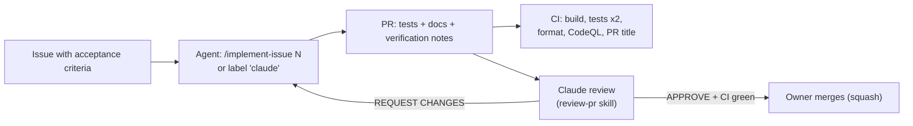

# Working with AI agents

This repository is designed to be developed mostly by AI coding agents, with a human owner who sets direction and
merges. The setup makes agents productive and keeps quality high without the owner reading every line.

## What agents read

| File | Loaded | Purpose |
| --- | --- | --- |
| `AGENTS.md` | Every session (Claude Code, Codex, Copilot, Cursor, ...) | Commands, repository map, non-negotiable rules, definition of done |
| `CLAUDE.md` | Every Claude Code session | Imports `AGENTS.md`, adds Claude-specific notes |
| `.claude/rules/*.md` | When a matching file is opened | Area rules: Core boundary, protocol, plugin, config page, tests, CI, docs |
| `.claude/skills/*/SKILL.md` | On demand | Procedures (`implement-issue`, `review-pr`, `release`) and reference knowledge (`hyperion-protocol`, `jellyfin-plugin`) |
| `docs/development/*` | When linked | The detailed design documentation |

Keep `AGENTS.md` short and true. When an agent repeatedly gets something wrong, fix the instructions (rule, skill or
doc) in the same PR as the code.

## The loop

1. **Write the issue** with clear acceptance criteria (the roadmap items are good starting points).
2. **Start an agent**:
    - locally: `claude` in the repository, then `/implement-issue 42`;
    - on GitHub: add the `claude` label to the issue, or comment `@claude implement this` (owners and collaborators
      only, see `.github/workflows/claude.yml`).
3. **Automatic review**: every non-draft PR gets a Claude review following `.claude/skills/review-pr/SKILL.md`,
   with inline comments and a final `Verdict:` line. Ask for fixes with `@claude address the review comments`.
4. **Merge** when CI is green and the verdict is APPROVE. The PR title becomes the changelog entry.

## Guardrails

- Branch protection requires CI to pass; agents cannot push to `main`.
- Workflows that use secrets do not run for fork PRs; `@claude` only reacts to owners, members and collaborators.
- Agents never create releases; release-please does, after the owner merges the release PR.
- The fake Hyperion server is the protocol reference; agents must not weaken it to make tests pass.

## Tips for good agent work

- One issue per concern; small PRs review better.
- Put hardware-dependent checks (real Hyperion, real TV) in the issue as explicit manual steps, and note in the PR
  whether they were done.
- If an agent needs knowledge it does not have (an API, a protocol detail), the fix is a doc or skill update so the
  next agent has it too.
