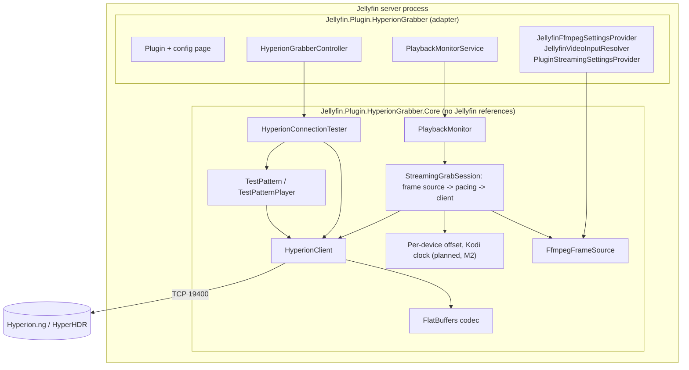
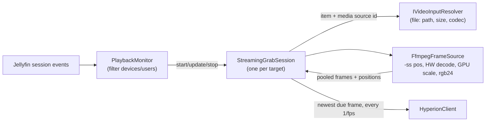

# Architecture

## Layers

- **Core** contains everything that can be written and tested without Jellyfin: the protocol, the client, the test
  pattern, and later the frame pipeline and sync engine. It depends only on the .NET shared framework.
- **Plugin** is a thin adapter. It turns Jellyfin concepts (sessions, items, media sources, encoding options) into
  Core inputs, hosts the background services, and provides the configuration page and admin API.

See [ADR 0004](adr/0004-core-library-boundary.md) for why.

## What exists today

| Component | Responsibility |
| --- | --- |
| `FlatBufferWriter`, `HyperionRequestWriter` | Allocation-free encoding of Register, Image, Clear, Color with the size prefix |
| `FlatBufferReader`, `HyperionReplyReader` | Bounds-checked decoding of replies from the network |
| `HyperionClient` | One registered connection: connect/register with timeouts, serialized sends, reply-draining receive loop, Clear on dispose. Never reconnects itself. |
| `IHyperionSink` | Abstraction of "where frames go"; `HyperionClient` implements it, tests use `RecordingSink` |
| `TestPattern`, `TestPatternPlayer` | Layout test picture and its paced playback, always clearing afterwards |
| `HyperionConnectionTester` | Config-page actions; returns results instead of throwing |
| `HyperionGrabberController` | Admin-only `POST HyperionGrabber/TestConnection` and `/TestPattern`, `GET HyperionGrabber/Clients` (devices and users of recent sessions for the config page) |
| `FfmpegFrameSource` (M1) | Runs FFmpeg from a start position and yields pooled RGB24 `VideoFrame`s at a constant rate; hardware decoding with CPU fallback; always kills and awaits the process ([ADR 0007](adr/0007-ffmpeg-frame-source.md)) |
| `FfmpegFrameSourceOptions`, `FfmpegArguments` | Output size from the aspect ratio, validation, and the FFmpeg command line per hardware acceleration method |
| `IFfmpegSettingsProvider` / `JellyfinFfmpegSettingsProvider` | Core interface for the server's FFmpeg path and hardware settings; the adapter reads Jellyfin's encoding options |

## Playback monitor (M1)

| Component | Responsibility |
| --- | --- |
| `PositionTracker` | Estimates the playback position from reports of different precision: a range that every agreeing report narrows ([ADR 0009](adr/0009-position-tracking.md)) |
| `PlaybackEvent`, `PlaybackState` | Host-independent playback report (start/progress/stop, session, device, user, item, media source, position, paused) and the state a session sees, time-stamped with `ReportedAt` |
| `PlaybackFilter` | Enabled switch, selected device ids (none = nothing matches), selected user ids (none = every user) |
| `PlaybackMonitor` | Non-blocking `Post`/`UpdateFilter` into a bounded queue (256, drop oldest); one processing task owns all state and decides which playback drives the target |
| `IGrabSessionFactory`, `IGrabSession` | Seam for the streaming pipeline: `Start(state)`, `Update(state)`, `DisposeAsync()`; implemented by `StreamingGrabSessionFactory` |
| `PlaybackMonitorService` (plugin) | `IHostedService` that subscribes to `ISessionManager.PlaybackStart/Progress/Stopped`, maps them with `PlaybackEventMapper` and feeds the saved filter (`IPlaybackFilterSource`) |

Rules the monitor implements:

- **One session per target.** There is one Hyperion target today, so at most one `IGrabSession` runs. Of all matching
  playbacks, the most recently started one drives it; when it stops, the most recent remaining one takes over with
  its last reported state. Multiple targets (M3) will make this decision per target.
- A progress report without a position keeps the estimated position (last report + elapsed), so it never looks like
  a seek to the start.
- A progress report for an unknown session counts as a start (playback that began before Jellyfin or the plugin
  started, or a device that was just selected). A report with a different item restarts the session.
- A filter change is applied immediately: sessions that no longer match are disposed, playing sessions that now
  match start.
- Tracked playbacks are capped at 64 (least recently reported forgotten first), so lost stop events cannot grow
  memory.
- A session that throws is logged and does not stop the monitor; the next report retries the start.

## Streaming (M1)

| Component | Responsibility |
| --- | --- |
| `StreamingGrabSessionFactory` | `IGrabSessionFactory` for real streaming; its internal constructor takes the frame source and Hyperion connection as delegates so tests can replace them |
| `StreamingGrabSession` | One playback: reads the settings, resolves the video, starts FFmpeg at the estimated position, connects to Hyperion and paces frames ([ADR 0008](adr/0008-streaming-session-pacing.md)) |
| `IVideoInputResolver` / `JellyfinVideoInputResolver` | Playing item + media source id → `VideoInput` (`file:` path, display size, codec), or the reason it is not supported (Live TV, remote, `.strm`, disc folders) |
| `IStreamingSettingsProvider` / `PluginStreamingSettingsProvider` | Hyperion host/port/priority and frame rate from the saved configuration, read once per playback start |
| `IFrameSource`, `IHyperionConnection` (internal) | The parts of `FfmpegFrameSource` and `HyperionClient` the session uses; fakes implement them in tests |

How a session behaves:

- **Start:** everything runs on the session's own task, so `Start` returns at once. Settings or media the plugin
  cannot use are logged (Warning / Information) and the session idles until playback stops. FFmpeg starts first;
  Hyperion is connected when the first frame is due, so a slow file open cannot hit Hyperion's idle timeout.
- **Pacing:** a `PeriodicTimer` ticks at the frame rate. Each tick estimates the position and sends the newest
  decoded frame at or before it; older due frames are dropped and go back to the pool. Late frames are never queued: a
  slow Hyperion, network or decoder means fewer frames.
- **Position:** a `PositionTracker` keeps the range the client's position can be in. The start report gives ±1 s,
  a whole-second report (Jellyfin for Kodi truncates) covers the following second, a precise one ±100 ms (while
  playing up to 250 ms more, because web clients report the position of their last update); reports that agree narrow
  the range, one that contradicts it replaces it. While playing the range moves on with time and widens by 0.1 % for clock
  differences; the estimate is its middle ([ADR 0009](adr/0009-position-tracking.md)).
- **Timing offset:** the configured light timing offset is added to the estimated position, so frames are decoded
  and sent earlier (or later); seek detection compares the reports without it.
- **Keep-alive:** without a new frame for 500 ms (pause, end of video, slow decoder) the last frame is resent, so
  Hyperion does not close the idle connection.
- **Long pause:** after the configured pause release time (default 15 s) FFmpeg is stopped and the Hyperion connection
  closed, so Hyperion shows its default; on resume decoding restarts at the position and Hyperion is connected again
  with the first frame.
- **Seek:** a report that moves the estimate by more than 1 s restarts FFmpeg at the new position. A decoder lagging more
  than 2 s behind is restarted too, after a 5 s grace period for opening and seeking the file.
- **Stop and failures:** stopping, a lost connection or a decoding error kills FFmpeg and disposes the Hyperion client
  (which clears the priority) in parallel. `DisposeAsync` waits at most 5 s, so the monitor never stalls.
- **Logging:** Information for start (`Streaming 160x90 at 25 fps …`) and stop (frames sent, dropped, decoder
  restarts), Debug for seeks, pause changes and position reports (how far each moved the estimate, and the remaining
  uncertainty), nothing per frame.

Design rules for the pipeline:

- **Bounded everything.** A small fixed pool of frame buffers; when Hyperion or the network is slow, drop frames,
  never queue them. When FFmpeg is slow, Hyperion gets fewer frames, never stale ones.
- **The pipe is the throttle.** FFmpeg writes raw RGB to stdout; when we stop reading (pause), it blocks instead of
  decoding ahead. Seeks restart FFmpeg at the new position.
- **Timestamps, not wall-clock guesses.** A constant-frame-rate filter makes frame *n* correspond to
  `start + n / fps`, so each frame is scheduled against the estimated client position.
- **One session per target** (TV/Hyperion pair); sessions are independent and cancellable.
- **Process hygiene.** FFmpeg processes are always killed and awaited when a session ends, including on errors and
  server shutdown.

Still planned: reconnecting after Hyperion restarts (M1), a per-device timing offset and a precise Kodi clock (M2),
HDR tone mapping and multiple targets (M3). See the [roadmap](../roadmap.md).

## Threading

- Sends on a `HyperionClient` are serialized with a `SemaphoreSlim`; one receive loop per client drains replies.
- Everything is async with `CancellationToken`; no thread is blocked waiting on I/O.
- Jellyfin event handlers must return quickly: they only post a state change to the session, which does the work
  on its own task.
