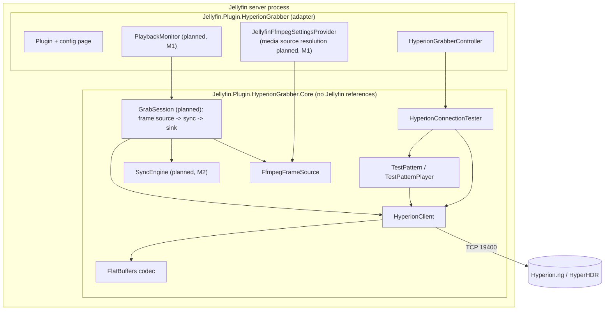
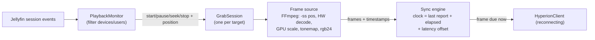

# Architecture

## Layers

- **Core** contains everything that can be written and tested without Jellyfin: the protocol, the client, the test
  pattern, and later the frame pipeline and sync engine. It depends only on the .NET shared framework.
- **Plugin** is a thin adapter. It turns Jellyfin concepts (sessions, items, media sources, encoding options) into
  Core inputs, hosts the background services, and provides the configuration page and admin API.

See [ADR 0004](adr/0004-core-library-boundary.md) for why.

## What exists today

| Component | Responsibility |
| --- | --- |
| `FlatBufferWriter`, `HyperionRequestWriter` | Allocation-free encoding of Register, Image, Clear, Color with the size prefix |
| `FlatBufferReader`, `HyperionReplyReader` | Bounds-checked decoding of replies from the network |
| `HyperionClient` | One registered connection: connect/register with timeouts, serialized sends, reply-draining receive loop, Clear on dispose. Never reconnects itself. |
| `IHyperionSink` | Abstraction of "where frames go"; `HyperionClient` implements it, tests use `RecordingSink` |
| `TestPattern`, `TestPatternPlayer` | Layout test picture and its paced playback, always clearing afterwards |
| `HyperionConnectionTester` | Config-page actions; returns results instead of throwing |
| `HyperionGrabberController` | Admin-only `POST HyperionGrabber/TestConnection` and `/TestPattern` |
| `FfmpegFrameSource` (M1) | Runs FFmpeg from a start position and yields pooled RGB24 `VideoFrame`s at a constant rate; hardware decoding with CPU fallback; always kills and awaits the process ([ADR 0007](adr/0007-ffmpeg-frame-source.md)) |
| `FfmpegFrameSourceOptions`, `FfmpegArguments` | Output size from the aspect ratio, validation, and the FFmpeg command line per hardware acceleration method |
| `IFfmpegSettingsProvider` / `JellyfinFfmpegSettingsProvider` | Core interface for the server's FFmpeg path and hardware settings; the adapter reads Jellyfin's encoding options |

## Planned pipeline (M1-M3)

Design rules for the pipeline:

- **Bounded everything.** A small fixed pool of frame buffers; when Hyperion or the network is slow, drop frames,
  never queue them. When FFmpeg is slow, Hyperion gets fewer frames, never stale ones.
- **The pipe is the throttle.** FFmpeg writes raw RGB to stdout; when we stop reading (pause), it blocks instead of
  decoding ahead. Seeks restart FFmpeg at the new position.
- **Timestamps, not wall-clock guesses.** A constant-frame-rate filter makes frame *n* correspond to
  `start + n / fps`, so the sync engine can schedule each frame against the estimated client position.
- **One session per target** (TV/Hyperion pair); sessions are independent and cancellable.
- **Process hygiene.** FFmpeg processes are always killed and awaited when a session ends, including on errors and
  server shutdown.

## Threading

- Sends on a `HyperionClient` are serialized with a `SemaphoreSlim`; one receive loop per client drains replies.
- Everything is async with `CancellationToken`; no thread is blocked waiting on I/O.
- Jellyfin event handlers must return quickly: they only post a state change to the session, which does the work
  on its own task.
