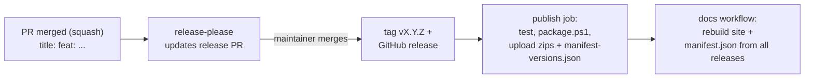

# Releasing

Releases are fully automated ([ADR 0006](adr/0006-release-automation.md)). Nobody edits versions, tags or the
changelog by hand.

## Flow

1. Every PR is squash-merged with a [Conventional Commits](https://www.conventionalcommits.org/) title
   (checked by the *PR title* workflow).
2. On each push to `main`, release-please updates a PR titled `chore(main): release X.Y.Z` with the next version
   (`feat` → minor, `fix`/`perf`/`deps`/`docs` → patch, `!` → breaking; before 1.0 breaking bumps the minor) and
   the generated `CHANGELOG.md`.
3. Merging that PR tags `vX.Y.Z` and creates the GitHub release. The `publish` job runs the tests, builds the two
   plugin zips with `build/package.ps1`, and attaches them plus `manifest-versions.json`.
4. The docs workflow rebuilds the site and regenerates `manifest.json` from the `manifest-versions.json` of every
   release (`build/New-PluginManifest.ps1`), then deploys to GitHub Pages.

## Versions

| Where | Example | Meaning |
| --- | --- | --- |
| Git tag / changelog | `v0.2.0` | Semantic version of the release |
| `version.txt` | `0.2.0` | Read by `Directory.Build.props`; updated by release-please |
| Plugin version (zip, manifest, assembly) | `0.2.0.0` / `0.2.0.1` | Release version + Jellyfin line (`.0` = 10.11, `.1` = 12) |

## Release assets

- `hyperion-grabber_X.Y.Z.0_jellyfin-10.11.zip`
- `hyperion-grabber_X.Y.Z.1_jellyfin-12.zip`
- `manifest-versions.json`: the two plugin repository entries (`version`, `targetAbi`, `sourceUrl`, MD5 `checksum`,
  `changelog`, `timestamp`)

Each zip contains only `Jellyfin.Plugin.HyperionGrabber.dll`, `Jellyfin.Plugin.HyperionGrabber.Core.dll` and
`meta.json`.

## Plugin repository

`https://25lion52.github.io/JellyfinHyperionGrabber/manifest.json` is generated, never committed. To rebuild it
(for example after deleting a broken release), run the *Docs & plugin repository* workflow manually.

## Required checks on the release PR

The release PR is opened and updated by the Release workflow with its own `GITHUB_TOKEN`. GitHub still runs `pull_request`
workflows for it (CI, CodeQL and the PR title check), but not `pull_request_target` ones, which is why the PR title check
uses `pull_request`. Merge the release PR like any other once its checks are green; no bypass is needed.

If a required check stays at *Expected — Waiting for status to be reported* (for example after GitHub changes this
behaviour), close and reopen the release PR: a reopen by a person starts every PR workflow.
