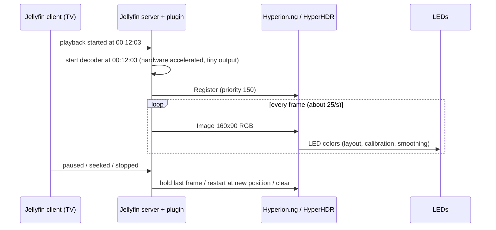

# How it works

## The idea: decode, do not capture

Ambilight-style setups usually *capture* the picture: an HDMI grabber between player and TV, or a screen grabber
running on the TV. On many devices that is impossible. On a Raspberry Pi with LibreELEC/Kodi, for example,
hardware-decoded video goes straight to a display plane that screen grabbers cannot see, and HDR or DRM content is
often blocked or washed out.

Jellyfin already has the original file. So the plugin **decodes the same video again on the server**, scaled down to a
few dozen pixels, keeps it in step with the client's playback, and sends each small frame to Hyperion.

## What happens where

| Step | Where | Notes |
| --- | --- | --- |
| Detect playback, pause, seek, stop | Jellyfin server | From the session reports every client sends, for the devices and users you select |
| Decode and downscale | Jellyfin server | Uses Jellyfin's FFmpeg and hardware acceleration, at the frame rate you set |
| HDR / Dolby Vision tone mapping | Jellyfin server | So LEDs get SDR colors *(planned, M3)* |
| Keep in sync with the client | Jellyfin server | Extrapolates between reports and applies your light timing offset |
| Map picture to LEDs | Hyperion | Your LED layout, any shape |
| Calibration, smoothing, black borders | Hyperion | Unchanged |
| Drive devices | Hyperion | WLED, Philips Hue, Adalight, ... |

## Synchronization

Because the server decodes independently, the LEDs are only as accurate as the plugin's idea of where the client is.
Clients report start, pause, resume, seek and their position from time to time; some (for example the Jellyfin
add-on for Kodi) only every 30 seconds or on events. Between reports the plugin assumes normal playback speed, and a
report that differs by more than a second (a seek) makes it decode from the new position. If Hyperion or the network
is slow, the plugin skips pictures rather than falling behind. The **light timing offset** corrects the constant
delay of the client, Hyperion's smoothing, the network and the LEDs.

A nice side effect: frames are available *before* the TV shows them, so the plugin can send them slightly early and
cancel out the LED delay, something capture-based systems cannot do.

## Resource use

The decoder outputs a tiny picture (by default about 160 pixels wide), which is all Hyperion needs. With hardware
decoding, most of the work happens on the GPU and the CPU load is small. The frames are a few hundred kilobytes per
second on the network.

## Privacy

Frames go only to the Hyperion server you configure, on your network. Nothing is sent to the internet.
