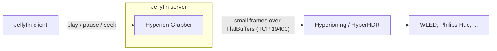

# Hyperion Grabber for Jellyfin

**Ambient lighting for everything you watch in Jellyfin.** The plugin streams the video that is playing to
[Hyperion.ng](https://github.com/hyperion-project/hyperion.ng) or [HyperHDR](https://github.com/awawa-dev/HyperHDR),
which drive your WLED strips, Philips Hue lights and every other LED device they support.

!!! note "Early preview"
    Version 0.x connects to Hyperion/HyperHDR and plays an LED layout test pattern, so you can set everything up and
    verify your LEDs today. **Streaming during playback** is the next milestone; see the [roadmap](roadmap.md).

- **[Getting started](getting-started.md)**: install, connect and test in five minutes.
- **[Hyperion setup](user-guide/hyperion-setup.md)**: FlatBuffers server, LED layout (including LEDs that do not run around the TV), WLED and Hue.
- **[How it works](how-it-works.md)**: why no capture card or TV app is needed.
- **[Troubleshooting](user-guide/troubleshooting.md)**: wrong port, Docker networking, wrong colors.

## Why this plugin

| | HDMI capture / TV grabber | Hyperion Grabber for Jellyfin |
| --- | --- | --- |
| Extra hardware | Capture card, splitter | None |
| Clients | One TV or box | Any Jellyfin client (Kodi/LibreELEC, Android TV, webOS, Tizen, web) |
| HDR / DRM content | Often washed out or blocked | Decoded from the file; tone-mapped *(planned)* |
| Latency | Always behind the picture | Frames are ready early; latency can be compensated *(planned)* |
| LED layout | Hyperion | Hyperion (unchanged) |

## How it fits together

The plugin only produces the picture. Hyperion keeps doing what it is good at: mapping the picture to your LEDs,
color calibration, smoothing and driving the devices.
